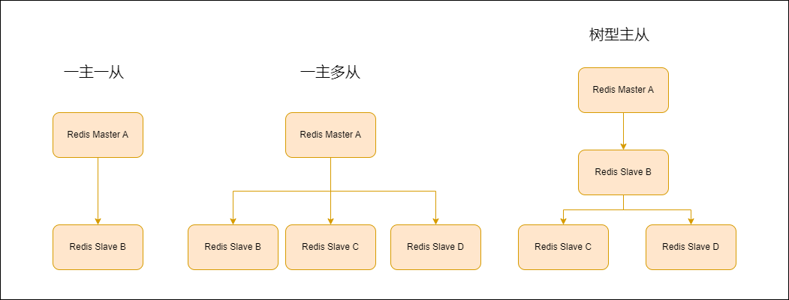
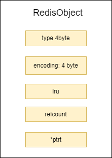
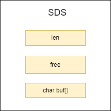
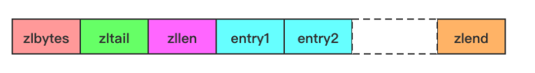

 

# Redis 


## 第六章 Redis主从复制


### 概述

Redis主要从复制是 Redis高可用的基础，Redis的哨兵机制和集群都是在主从复制的基础上进行的


### 主从配置

1. 在Redis的配置文件中加入slaveof {masterHost} {masterPort}，启动Redis后就会生效
2. 在redis-sever启动命令中加上 --slaveof  {masterHost} {masterPort}生效
3. 直接使用命令 slaveof {masterHost} {masterPort}生效

​	可以通过命令`info replication`查看当前Redis的主节点或者是从节点的信息

​	断开复制可以使用slaveof no one命令进行，执行命令后，Redis会断开主从复制关系，当前从节点升为主节点

​    也可以使用`slaveof {newMasterHost} {newMasterPort}`选择新的节点作为主节点，执行命令后，Redis会断开当前的主从复制关系，建立新的主从复制关系，从节点会删除自身所有数据，对新节点进行主从复制


### 主从复制拓扑结构

Redis的主从拓扑结构主要有三种形式

1. 一主一从

​		一主一从的模式是最简单的模式，需要注意的是如果主节点没有开启持久化，当主节点重启后，由于没有持久化，导致节点的数据为空，然后从节点继续执行主从复制，就会导致从节点的数据也为空，所以在这种情况下，应该先断开主从复制关系，然后再重启主节点

1. 一主多从

​	一主多从的模式在读写分离的情况下可以减轻主节点的请求压力，并且如果需要执行keys *等长时间阻塞的命令可以在一台从节点上进行防止主节点被阻塞而影响线上服务的稳定性。

​	但是一主多从也有问题，在写并发量比较高的情况下，会导致主节点多次发送写命令，占用过多的网络带宽，同时也加重了主节点的负载影响线上服务的稳定性

1. 树形主从

​		树型主从可以很好的解决主从复制时主节点的带宽消耗过多，并且也不会有太大的负载，因为此时这些压力都被转移到了主节点的直接从节点上，只不过树形节点的维护成本较高。




### Redis主从复制过程

1. 从节点保存主节点的信息

2. 主从建立socket连接

3.  从节点发送ping命令

   ping的目的有两个，第一个目的是检测主从之间的socket连接是否可用，第二个目的是判断主节点是否可接受处理命令

4. 权限验证，如果主节点设置了requirepass参数，则需要密码验证

5. 同步数据集，首次连接会进行全量复制

6. 命令的持续复制


### Redis数据同步原理

1. 复制偏移量

   * 主节点在执行写入命令后，会把命令的字节长度做累加记录，可以通过`info replication`命令查看master_repl_offset字段 
   * 从节点会每分钟上报自己的偏移量，主节点会将从节点的上报的偏移量记录下来
   * 从节点在收到主节点的同步命令执行完毕后，也会增加自身的偏移量，可以通过`info replication`命令查看slave_repl_offset字段 

2. 复制积压缓冲区

   主节点在有从节点连接时会维护一个命令的积压缓冲区，默认大小为1MB，主节点在发送命令给从节点时也会将命令保存到缓冲区中，积压缓冲区用于部分复制和复制命令丢失的数据补救

3. 主节点运行ID，Redis的每次启动都会为其分别一个40为的十六进制的字符串作为运行ID，此ID用于唯一识别一个Redis主节点，从节点会保存主节点的ID来识别自己正在复制的是那个主节点。由于在主节点重启变更了数据（从新加载RDB或者AOF文件）之后，从节点再根据偏移量去复制是不安全的，此时从节点发现主节点的ID和自己保存的ID不一致，就会做全量复制。

4. psync 命令，psync runID offset

#### 全量复制

1. 发送psync runID offset命令，第一次复制时，runID和offset信息都没有，所以runID 为? offset为-1，
2. 主节点接收到命令发现runID为?，就会触发全量复制，回复FULLRESYNC
3. 从节点保存主节点的runID和偏移量offset
4. 主节点开始bgsave生成RDB文件
5. 主节点发送RDB文件，从节点开始接受，如果文件过大，导致带宽占用过多，就会面临传输时间过慢的问题，从节点发现如果整个过程的时间超过了`repl-timeout`（默认60s）参数，就会放弃接受RDB文件并且清理已经下载的临时文件，导致主从复制失败；如果主节点的数据过大，建议调大这个参数
6. 在主节点传输RDB文件期间，如果还有写请求到达主节点，主节点会执行写命令，并且把写命令同步到从节点的客户端缓冲区中，如果RDB文件过大导致传输时间太长，主节点就会不断的往缓冲区中写入命令，有可能导致缓冲区溢出，。默认配置为`client-output-buffer-limit slave 256MB 60MB 60`，如果在60s内从节点客户端缓冲区的大小超过60MB或者从节点客户端缓冲区的大小以及超过256MB，主节点就会断开主从复制客户端的连接，导致主从复制失败
7. 从节点接受完毕RDB文件后会清空自身的所有数据、
8. 从节点开始加载RDB文件
9. 从节点加载完毕RDB文件后，如果开启了AOF，会立即进入bgrewriteof过程


#### 部分复制

1. 当主从节点之间出现网络断开时超过`repl-timeout`时，主节点会断开主从复制连接
2. 在断开连接期间，主节点执行的写命令依然会向复制积压缓冲区中写入
3. 当主从节点网络恢复后，从节点会重新连接上主节点（从节点会有定时任务一直重连主节点）
4. 重新连接后，由于从节点在之前以及保存了主节点的runID和offset，所以发送psync runID offset命令
5. 主节点接收到命令后会对比runID是否和自身的一致，一致就会根据offset参数在复制积压缓冲区中寻找，如果找到了就会向从节点发送+CONTINUE响应
6. 主节点根据偏移量将缓冲区的数据发送给从节点


## 第八章 内存管理

### 内存消耗在哪里

`info memory`可以列出redis当前的内存使用情况

used_memory_rss：操作系统视角的redis物理内存使用情况

used_memory：redis视角内存使用情况

mem_fragmentation_ratio：used_memory_rss / used_memory，如果这个值大于1，就代表redis的有内存碎片，如果这个值小于1，就代表redis使用了交换内存

#### 对象内存

对象内存时redis占用最大的一部分，不能忽视键的大小，在使用redis时键尽量精简，对象内存可以简单的理解为`sizeof(keys)+sizeof(values)` 

#### 缓冲内存

1. 客户端的输入输出缓冲
   * 客户端的输入缓存不能调整，最大为1G，当超过之后就会断开连接
   * 普通客户端的输出缓冲区：参数默认是`client-output-buffer-limit normal 0 0 0`（normal代表普通客户端），没有对客户端进行限制 ，生产环境中注意不要使用如monitor这样的命令，一旦redis的命令并发量很大，执行monitor的客户端的输出缓冲区就会瞬间增加，导致redis内存不足
   * 从节点的客户端缓冲区：默认参数是`client-output-buffer-limit slave 250 64 60`，64 60代表在60s内达到64MB就会断开客户端连接，250MB代表一旦缓冲区超过这么多就会断开客户端
   * 发布订阅缓冲区：默认参数是`client-output-buffer-limit pubsub 32 8 60`，当消费的速度满，而生产的速度快时，就会造成连接断开
2. 复制积压缓冲区：这部分的缓冲区时所有的从节点客户端公用的，建议调大，调大的目的是降低全量复制的概率
3. AOF的缓冲区：这部分缓冲区用户无法控制，只能控制AOF的刷新速度，一般来说不用关心


#### 内存碎片

redis的有多种内存管理方式，但基本上所有的内存管理方式都会将对象根据大小进行分类，不同的对象分配不同的内存块，这样可以增加内存的分配效率，还能方便的管理内存。redis会将内存分为不同规格大小的块，比如[0-8B],[9-16B]....，如果一个对象是5B，那么redis就会为其分配8B的内存，那么剩下的3B就变成了内存碎片

以下场景容易出现内存碎片问题：

1. 频繁的更新操作，例如进行append操作会导致redis对字符串预申请内存空间，导致内存碎片
2. 大量的键过期，键对象过期删除后，内存空间得不到充分释放（why）

解决方法：

	1. 尽量数据对齐，例如尽量使用数字类型或者固定长度的字符串类型（不是很懂原理）
	1. 在高可用的redis集群或者哨兵集群中，可以将内存碎片高的主节点转换为从节点进行重启操作


#### 子进程fork时也会对内存进行消耗


### 内存回收

#### 回收过期键

1. 惰性删除：当客户端获取键值的时候，判断当前key是否已经过期，如果过期了返回空并且删除键；这种情况就有弊端，如果过期键一直得不到访问的话就会导致过期键一直得不到删除，导致内存浪费
2. 定时任务删除：redis会维护一个定时任务，进行定时删除
   1. Redis会在每个数据库中抽取20个键，如果有超过25%的键过期，那么就会循环执行回收
   2. 如果循环执行回收超过25s，就会进入快模式，快模式每2s进行一次，超时时间时1s
   3. 反复执行直到键的过期率小于25%为止

#### 内存达到maxmemory触发内存回收策略

当设置了maxmemory的参数时，redis就会执行内存回收策略，回收策略有6种

* noeviction：当内存超过maxmemory时，不执行任何内存回收，拒绝客户端的请求
* volatile-lru：根据lru算法删除超时的键，直到内存小于maxmemory为止
* allkeys-lru：根据lru算法删除所有的键，直到内存小于maxmemory为止
* allkeys-random：对所有的键进行随机删除，直到内存小于maxmemory为止
* volatile-random：随机删除过期的键，直到内存小于maxmemory为止
* volatile-ttl：根据键的ttl属性，删除将要过期的键，如果没有，回退到noevication策略


## 内存优化

### RedisObject对象



`type`： 代表数据类型； `string list hash set zset`

`encoding`：代表数据的编码形式

`lru`：记录键的最后一次访问时间，可以配合volatile-lru或者是allkeys-lru算法进行内存回收

`refCount`：引用次数，可以用作共享对象使用，当refCount为0时，redis可以直接回收

`*ptr`：数据指针


其实这里不是很理解，RedisObject将每个值对象都包裹了？，那么ziplist编码类型的数据结构呢，是怎样使用RedisObject对象的呢？


### 缩短键值对象的大小

1. 键的字符串形式可以尽量精简
2. value可以使用压缩率高的序列化方式进行压缩达到内存占用减少的目的

### 共享对象池

Redis为数字类型建立了一个[0-9999]的共享对象池，如果多个键都引用了相同的数字，那么这个数字的RedisObject对象的refcount就会增加，起到一个对象共享的效果。

需要注意的是，如果设置了maxmemory并且内存回收策略是volatile-lru或者是allkeys-lru，都会导致共享对象失败，因为对象被共享了，就不好记录RedisObject的lru字段了。


### 字符串优化



Redis的字符串对象有三个属性

`len`：代表字符串的长度

`free`：代表buf中剩余的空间

`buf`：存储字符串的数组

字符串内存分配策略：

1. 第一次创建时不会预分配，len就是字符串长度，free为0
2. 修改字符串如果free不够分配，并且字符串长度小于1M那么每次都会预分配1倍的内存，例如原来是5B，增加了5B，那么就会预分配10B，总占用字节长度就是5B+5B+10B+1B（字符串结尾的标识符）
3. 修改字符串如果free不够分配，并且字符串长度大于1M，那么每次都会预分配1MB的内存

所以字符串的操作尽量不要使用append，可以直接使用set操作


### 编码类型


#### ziplist编码

ziplist编码可以用于hash，zset，list三种数据结构的底层编码



| 属性    | 类型     | 长度   | 用途                                                         |
| ------- | -------- | ------ | ------------------------------------------------------------ |
| zlbytes | uint32_t | 4 字节 | 记录整个压缩列表占用的内存字节数：在对压缩列表进行内存重分配，或者计算 zlend 的位置时使用。 |
| zltail  | uint32_t | 4 字节 | 记录压缩列表表尾节点距离压缩列表的起始地址有多少字节：通过这个偏移量，程序无需遍历整个压缩列表就可以确定表尾节点的地址。 |
| zllen   | uint16_t | 2 字节 | 记录了压缩列表包含的节点数量，当这个属性的值小于 UINT16_MAX（65535）时，这个属性的值就是压缩列表包含节点的数量；当这个值等于 UINT16_MAX 时，节点的真实数量需要遍历整个压缩列表才能计算得出。 |
| entry   | 列表节点 | 不定   | 压缩列表包含的各个节点，节点的长度由节点保存的内容决定。     |
| zlend   | uint8_t  | 1 字节 | 特殊值 0xFF（十进制 255），用于标记压缩列表的末端。          |


entry的数据结构为：


`previous_entry_length` 字段表示前一个元素的字节长度，占 1 个或者 5 个字节：

- 当前一个元素的长度小于 254 字节时，用 1 个字节表示；
- 当前一个元素的长度大于或等于 254 字节时，用 5 个字节来表示。而此时 `previous_entry_length` 字段的第一个字节是固定的 0xFE（十进制为 254），后面 4 个字节才真正表示前一个元素的长度。
- 假设已知当前元素的首地址为 p，那么 `p-previous_entry_length` 就是前一个元素的首地址，从而实现压缩列表从尾到头的遍历。

`encoding` 字段表示当前元素的编码，记录了节点的 content 字段所保存数据的类型以及长度：

- 1 字节、2 字节或者 5 字节长，值的最高位为 00、01 或者 10 的是字节数组编码：这种编码表示节点的 content 属性保存着字节数组，数组的长度由编码除去最高两位之后的其他位记录；
- 1 字节长，值的最高位以 11 开头的是整数编码：这种编码表示节点的 content 字段保存着整数值，整数值的类型和长度由编码除去最高两位之后的其他位记录；

`content` 字段存储节点的值，节点值可以是一个字节数组或者整数，值的类型和长度由节点的 encoding 属性决定。


ziplist编码不适合长度过长的数据结构，也不适合value值过大的数据结构

1. 长度过长，ziplist获取元素的速度很慢
2. value值过大


为什么ziplist可以节省内存？

目前来说我的观察是，hash结构来说，dicEntry和 ziplist的Entry的数据相差过大，dicEntry出去key和val的字节数还有24字节的无效占用，二ziplist的entry一般的情况只有6个字节的占用（key2个字节，prev_len 1 个字节和encoding 2 个字节），所以一个元素就相差了18个字节，当元素达到1000w时，就是180M？

## Redis Sentinel

### Sentinel 如何启动

- 通过redis-sentinel命令启动

<aside> 💡 redis-sentinel sentinel.conf

</aside>

- 通过redis-server命令加—sentinel参数启动

<aside> 💡 redis-server sentinel.conf —sentinel

</aside>

其实最重要的是sentinel.conf配置文件

```jsx
sentinel monitor mymaster 127.0.0.1 6379 2
sentinel down-after-milliseconds mymaster 30000
sentinel parallel-syncs mymaster 1
sentinel failover-timeout mymaster 180000
#sentinel auth-pass <master-name> <password>
#sentinel notification-script <master-name> <script-path>
#sentinel client-reconfig-script <master-name> <script-path>
```

- sentinel monitor

<aside> 💡 sentinel monitor <master-name> <ip> <port> <quorum>

</aside>

master-name 代表sentinel监控的节点名称

ip-port 是节点的地址

quorum用于故障发现和判定，只有至少有quorum个节点认为节点是不可达的时候才能对节点进行客观下线

sentinel节点会对所有节点进行监控，虽然在配置文件中没有对其他的从节点进行配置，但是Sentinel节点会从主节点获取有关从节点和其他Sentinel节点的信息，当所有的节点启动后，Sentinel获取到所有信息后就会将信息存储到配置文件中

```jsx
sentinel monitor mymaster 127.0.0.1 6379 2
sentinel config-epoch mymaster 0
sentinel leader-epoch mymaster 0
#发现两个slave节点
sentinel known-slave mymaster 127.0.0.1 6380
sentinel known-slave mymaster 127.0.0.1 6381
#发现两个sentinel节点
sentinel known-sentinel mymaster 127.0.0.1 26380 282a70ff56c36ed56e8f7ee6ada741
24140d6f53
sentinel known-sentinel mymaster 127.0.0.1 26381 f714470d30a61a8e39ae031192f1fe
ae7eb5b2be
sentinel current-epoch 0
```

- sentinel down-after-milliseconds

<aside> 💡 sentinel down-after-milliseconds <master-name> <times>

</aside>

每个Sentinel节点都会定期发送ping命令来判断其余的数据节点是否可达，如果超过了times时间，就会判定不可达，这是一个Sentinel节点对其他节点的主观下线的过程

- sentinel parallel-syncs

<aside> 💡 sentinel parallel-syncs <master-name> <nums>

</aside>

Sentinel领导节点进行故障转移操作之后，选出了新的主节点，其他的从节点就会向新的主节点进行复制，parallel-syncs参数就会限制在一次故障转移之后每次向主节点发起复制操作的从节点的个数

- sentinel failover-timeout

<aside> 💡 sentinel failover-timeout <master-name> <timeout>

</aside>

Redis的故障转移分为四个节点，这个命令其实分别作用在这个四个节点

1. 从从节点中选择一个节点作为新的主节点
2. 将选中的从节点升级为主节点
3. 执行新的主从复制
4. 等待原来的主节点回复后去复制新的主节点

这个参数具体就是作用在这四个步骤，这里不详细叙述

### Sentinel客户端的原理

Sentinel客户端的实现必须提供两个参数，Sentinel节点地址集合和MasterName

- 客户端首先会从节点集合中找到一个可用的Sentinel节点进行连接
- 然后使用sentinel get-master-addr-by-name masterName命令获取到主节点的信息
- 客户端获取到主节点的信息后会通过info replication命令来确定这个节点是否是主节点
- 保持和Sentinel节点集合的联系，时刻获取关于主节点的相关信息

实际上通过Sentinel的客户端连接Redis时最终还是获取到了主节点的信息，然后跟主节点进行交互，Sentinel仅仅是在节点信息变化之后将变化的信息及时的通知到客户端

### Sentinel 原理

每个Sentinel节点都会有三个定时任务

- 每隔10s Sentinel节点就会向其他的节点发送Info Replication命令获取到节点的信息，这就是为什么Sentinel节点不用配置从节点的信息，当Sentinel节点向主节点发送这个命令后就会自动获取到的从节点的信息，来更新自己的配置文件
- 每隔2s Sentinel节点都会向主节点的 **Sentinel**:hello 频道发送自己的对主节点判断信息以及自己的信息，同时每个Sentinel节点也会订阅这个频道，以此来获取所有的Sentinel节点的信息
- 每隔 1s Sentinel节点会向所有的节点发送ping命令做一次心跳监测机制，来确认这些节点是否可达

> 主观下线

Sentinel在每 1s 发送ping命令后，如果节点超过down-after-milliseconds没有进行有效的回复，Sentinel节点就会对该节点进行主观下线，意思就是当前Sentinel节点的一家之言，存在误判的可能

> 客观下线

当Sentinel主观下线的节点是主节点时，Sentinel节点就会通过sentinel ismaster-down-by-addr命令向其他的Sentinel节点进行确认，如果其他的Sentinel节点也觉得这个主节点有问题，并且个数超过quorum时，就会对该主节点进行客观下线的决定

<aside> 💡 sentinel is-master-down-by-addr <ip> <port> <current_epoch> <runid>

</aside>

ip：主节点IP

port：主节点端口

current-_epoch: 当前配置纪元

runid：这个参数有两个类型，当runid为*时，代表当前Sentinel节点只是向其他的节点进行客观下线的确认过程；当runid时Sentinel的自己的runId时，代表当前Sentinel节点希望其他的Sentinel节点同意自己作为领导者的请求

> 选举领导者

1. 当Sentinel节点确认主节点主观下线后，就会向其他Sentinel节点发送sentinel is-master-down-by-addr 命令，请求将自己作为主节点
2. 收到这个命令的Sentinel节点会判断自己是否已经同意过其他的Sentinel节点的sentinel is-master-down-by-addr 命令请求，如果没有就会同意该请求，否则拒绝
3. 如果该Sentinel节点发现自己的票数已经大于等于max（quorum，num（sentinels）/2+1），那么它将成为领导者
4. 如果当前过程没有选出领导者，那么进入下一次选举

## Redis集群

### 搭建集群

- 准备节点

Redis中集群节点需要进行一定的配置

```jsx
#节点端口
port 6379
# 开启集群模式
cluster-enabled yes
# 节点超时时间，单位毫秒
cluster-node-timeout 15000
# 集群内部配置文件
cluster-config-file "nodes-6379.conf"
```

cluster-enabled yes 是开启集群模式必须的配置，Redis集群节点在启动之后如果没有集群的配置文件，会自动创建一份，通过cluster-config-file控制配置文件的名字，这个文件是在集群模式下新增的一个配置文件，当集群的节点信息变化时，Redis会自动将集群中的状态同步到配置文件中，在第一次启动Redis集群节点时，Redis并不知道其他节点的信息，需要手动将节点之间关联起来

- 节点握手

节点握手是指一批运行在集群模式下的节点通过Gossip协议彼此通信。

由客户端发起

<aside> 💡 cluster meet {ip} {port}

</aside>

例如客户端向节点6379发送命令：client meet 127.0.0.1 6380，代表让节点6379和6380进行彼此握手，大概步骤如下

1. 节点6379本地创建6380的节点信息对象，并发送meet消息
2. 节点6380接收到后，首先保存6379的信息对象，并返回pong
3. 之后两个节点之间就会彼此定期通过pingpong进行通信

当在6379节点上对所有的集群节点都meet后，握手状态会在集群中传播，例如6379又meet 6381节点，在接下来6379和6380的通信中，6379会携带6381的信息，所以集群中的其他节点都可以相互知道对方

可以通过命令cluster nodes查看集群中的节点信息

```jsx
127.0.0.1:6379> cluster nodes
4fa7eac4080f0b667ffeab9b87841da49b84a6e4 127.0.0.1:6384 master - 0 1468073975551
5 connected
cfb28ef1deee4e0fa78da86abe5d24566744411e 127.0.0.1:6379 myself,master - 0 0 0 connected
be9485a6a729fc98c5151374bc30277e89a461d8 127.0.0.1:6383 master - 0 1468073978579
4 connected
40622f9e7adc8ebd77fca0de9edfe691cb8a74fb 127.0.0.1:6382 master - 0 1468073980598
3 connected
8e41673d59c9568aa9d29fb174ce733345b3e8f1 127.0.0.1:6380 master - 0 1468073974541
1 connected
40b8d09d44294d2e23c7c768efc8fcd153446746 127.0.0.1:6381 master - 0 1468073979589
2 connected
```

在节点握手过后，集群还不能使用，还需要为集群分配slots，只有当16384个槽全部分配给节点后，集群才进入在线状态

- 分配槽

可以通过cluster addslots命令为节点分配槽信息

```jsx
redis-cli -h 127.0.0.1 -p 6379 cluster addslots {0...5461}
redis-cli -h 127.0.0.1 -p 6380 cluster addslots {5462...10922}
redis-cli -h 127.0.0.1 -p 6381 cluster addslots {10923...16383}
```

通过cluster info命令查看集群的槽分配状态

```jsx
127.0.0.1:6379> cluster info
cluster_state:ok
cluster_slots_assigned:16384 # 被分配的槽的数量
cluster_slots_ok:16384
cluster_slots_pfail:0
cluster_slots_fail:0
cluster_known_nodes:6
cluster_size:3
cluster_current_epoch:5
cluster_my_epoch:0
cluster_stats_messages_sent:4874
cluster_stats_messages_received:4726
```

### 节点通信

- Gossip协议

<aside> 💡 Gossip协议的主要职责就是信息交换，节点之间互相发送Gossip消息，来维护集群的节点信息，Gossip协议有四种类型的消息

1. meet消息，新加入的节点会发送meet 消息到其他节点，节点接收到meet 消息后会保存新加入的节点消息，并且回复pong消息
2. ping消息，集群中最频繁的消息，集群的每个节点向其他的节点发送ping消息，ping消息发送封装了自身节点和部分其他节点的状态数据
3. pong消息，当节点接受到meet和ping消息后，需要回复pong消息，pong消息包含了回复节点的状态数据
4. fail消息，当节点判断集群中另一个节点下线后，会向集群广播一个fail消息，其他节点接收到fail消息后会将对应节点更新为下线节点 </aside>

- 节点选择

Gossip协议天然拥有分布式特性，但是他的成本也是很大的，因为内部需要频繁的进行节点信息交换，ping/pong消息都会携带节点自身数据和其他的节点数据，所以会对带宽有一定的消耗。Redis集群每个节点每秒会执行10次的节点通信，选择通信的节点算法为

<aside> 💡 每秒随机5次找出最久没有通信的节点+(最后通信时间大于cluster_node_timeout/2 每100ms执行一次)

</aside>


所以每秒需要发送ping的数量为

<aside> 💡 1+10*num（node.pong_received>cluster_node_timeout/2）

</aside>

当带宽资源紧张时可以适当调高cluster_node_timeout参数

### 集群伸缩

### 请求路由

- MOVED 重定向

在Redis集群模式下，客户端请求一个数据时，节点首先会计算出key所在的槽，如果槽是自身负责的，直接返回值，如果自身没有负责，则返回Moved targetIp targetPort错误，代表当前操作的建在节点Ip=targetIp port=targetPort上

- Asked 重定向

如果Redis集群当前正在伸缩，例如127.0.0.1:6379 节点正在给127.0.0.1:6380节点迁移部分槽数据，客户端发送获取数据的请求127.0.0.1:6379节点，当前节点发现key数据已经被迁移到6382节点后，就会返回AKED 重定向错误

- SMART客户端

SMART客户端是指，客户端维护了槽和Redis节点的关系，当用户获取数据时，客户端能在本地就可以获取到该键值对应的Redis节点，减少路由消耗。

例如JedisCluster客户端在初始化时就会选择一个节点执行cluster slots命令

<aside> 💡

127.0.0.1:6379> cluster slots

1. (integer) 0 // 开始槽范围
2. (integer) 1365 // 结束槽范围
3. "127.0.0.1" // 主节点ip
4. (integer) 6385 // 主节点地址
5. "127.0.0.1" // 从节点ip
6. (integer) 6386 // 从节点端口
7. (integer) 5462
8. (integer) 6826
9. "127.0.0.1"
10. (integer) 6385
11. "127.0.0.1"
12. (integer) 6386 </aside>

这样就能获取到槽和节点之间的关系，然后将关系缓存起来。这样缓存起来的数据总有过期的时候，比如说当Redis集群出现集群伸缩时，那么客户端就需要去更新缓存了，什么时候更新呢？如果出现请求数据了重定向错误时，客户端就会自动会更新缓存

这里需要注意一点的是，集群伸缩进行中的时候，客户端会返回AKED 重定向，此时客户端并不需要更新本地缓存，因为客户端并不知道什么时候集群伸缩才能进行完毕，如果直接更新缓存的话，还有一些没有迁移完成的数据就会访问不到，所以只有集群伸缩完毕后，客户端请求数据时就会收到MOVED重定向错误，这个时候就可以更新本地缓存了，这就是ASKED和MOVED两个重定向的区别


- SMART客户端的缺点，为每个节点都维护了一个连接池，当节点数量很多时客户端就会消耗很多连接以及内存

### 故障转移

- 主观下线

每个节点都维护了其他节点的信息，包括上一次回复其他节点回复ping消息的时间，上面提到了节点会每秒在节点链表中寻找大于cluster-node-time/2时间没有通信过的其他节点进行通信，如果节点一直没有回复，并超过了cluster-node-time时间，当前节点就会对没有回复的节点进行主观下线

- 客观下线

节点在对另一个节点主观下线后，就会在每秒通信时发送ping 消息，这个消息就会包含下线节点的信息，当集群不断通信时，下线节点的信息就会对传播到大部分的节点，如果某个节点发现当前已经有大部分节点都记录了该下线节点的信息，就会广播fail消息，对该节点进行客观下线

每个节点都会维护下线节点的信息，其中每个下线节点都会有一个链表，这个链表就是报告节点（报告下线节点）的集合，每次节点接收到其他节点的ping消息后，如果这个消息包含了下线节点，就会通过这个下线节点获取到报告节点的集合，如果节点的数量已经大于了集群的一半加1，就会进行客观下线